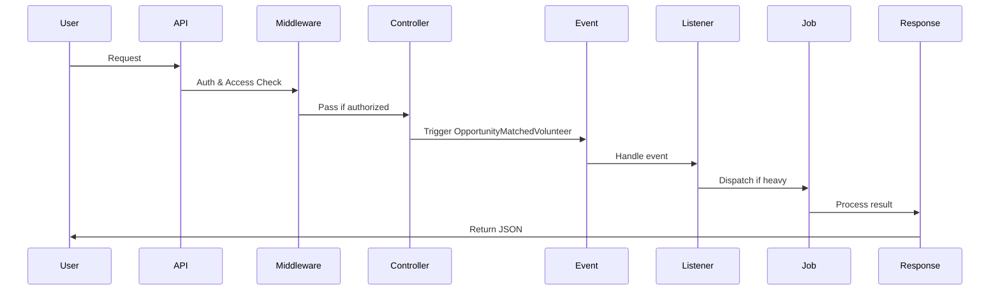

# 📖 Organizations & Opportunities Module

## 1. Introduction
This module manages **Organizations**, **Opportunities**, **Opportunity Skills**, and **Documents**.  
It is built with **Laravel modular architecture**, using **Spatie Log** and **Spatie Permissions** for logging and role-based access control, and **Laravel Resources** for clean API responses.

---

## 2. Tools & Technologies
- **Laravel Events & Listeners** – event-driven flow.
- **Spatie Log** – activity logging.
- **Spatie Permissions** – role & permission management (system-admin, manager, owner).
- **Laravel Resources & Requests** – data formatting and validation.
- **Middleware** – `auth:sanctum`, `org.access`, `opportunity.access`, `document.access`.

---

## 3. Flow
1. **User Request** → API endpoint.
2. **Middleware** → checks authentication & permissions.
3. **Controller Action** → executes logic (CRUD, nearest/farther search).
4. **Event Trigger** → e.g. `OpportunityMatchedVolunteer`.
5. **Listener** → handles event (notifications, updates).
6. **Job (optional)** → heavy or delayed tasks.
7. **Response** → JSON via Resource.

---

## 4. Routes

### Organizations
- `GET /api/v1/organizations` → **Fetch only active organizations**.  
- Regular user:
  - Can register/login.
  - Can create a new organization, but it will be **not active** by default.  
- **System-admin**:
  - Fetch not active organizations → `GET /api/v1/organizations/notactive`.
  - Activate organizations → `PATCH /api/v1/organizations/{organization}/activate`.

### Opportunities
- `GET /api/v1/opportunities` → Get all opportunities.
- `GET /api/v1/opportunities/{opportunity}` → Get specific opportunity.
- `POST /api/v1/opportunities` → Create new opportunity.
- `PUT /api/v1/opportunities/{id}` → Update opportunity.
- `DELETE /api/v1/opportunities/{opportunity}` → Delete opportunity.

### Opportunity Skills
- **Pivot table** linking Opportunities ↔ Skills (from Volunteers module).  
- Defines required skills for each opportunity.  
- Routes:
  - `GET /api/v1/opportunity-skills`
  - `POST /api/v1/opportunity-skills`
  - `GET /api/v1/opportunity-skills/{id}`
  - `PUT|PATCH /api/v1/opportunity-skills/{id}`
  - `DELETE /api/v1/opportunity-skills/{id}`

### Opportunity Documents
- `GET /api/v1/opportunities/{opportunity}/documents` → Get documents for an opportunity.
- `POST /api/v1/opportunity-documents` → Upload new document.
- `GET /api/v1/opportunity-documents/{id}` → Get specific document.
- `DELETE /api/v1/opportunity-documents/{id}` → Delete document.

### Nearest/Farther
- `POST /api/v1/opportunities/nearest` → Find nearest opportunities.
- `POST /api/v1/opportunities/farther` → Find farther opportunities (with `throttle:5,1`).

---

## 5. Middleware & Permissions Summary

| Route Group            | Middleware                  | Notes |
|------------------------|-----------------------------|-------|
| Organizations          | `org.access`                | Regular user creates not active orgs, system-admin activates them |
| Opportunities          | `opportunity.access`        | CRUD operations |
| Opportunity Skills     | `opportunity.skills.access` | Pivot table CRUD |
| Opportunity Documents  | `document.access`           | Document management |
| Nearest/Farther        | `auth:sanctum` + `throttle` | Search nearest/farther |

---

## 6. Flow Diagram (Mermaid)

---

## 7. Future Notes
- Improve partial updates for documents.
- Add advanced logging for events.
- Extend policies for new scenarios.
- Support localization in API responses.

---
## 8. User Roles & Capabilities

| Role          | Capabilities |
|---------------|--------------|
| **Regular User** | - Can register/login using `auth:sanctum`. - Can create a new organization, but it will be saved as **not active**. - Can access and view only **active organizations** via `GET /api/v1/organizations`. |
| **System Admin** | - Can fetch not active organizations via `GET /api/v1/organizations/notactive`. - Can activate organizations via `PATCH /api/v1/organizations/{organization}/activate`. - Has full CRUD permissions on organizations and opportunities. - Oversees activation workflow and ensures organizations become active. |

---

### Activation Workflow
1. **Regular User** logs in and creates a new organization → status = `not active`.
2. **System Admin** reviews pending organizations via `/organizations/notactive`.
3. **System Admin** activates the organization → status = `active`.
4. Once active, the organization becomes visible in `GET /api/v1/organizations`.

---
