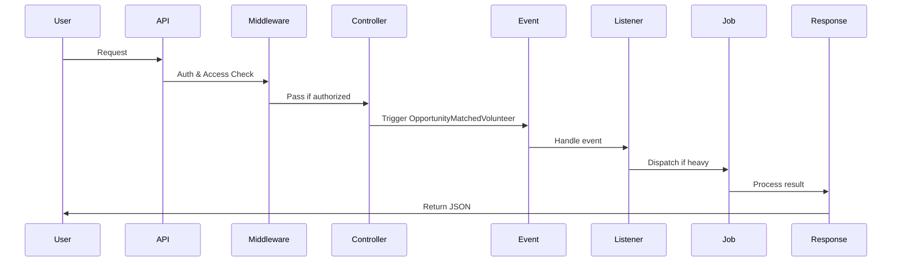

<p align="center"><a href="https://laravel.com" target="_blank"></a></p>

<p align="center">
<a href="https://github.com/laravel/framework/actions"></a>
<a href="https://packagist.org/packages/laravel/framework"></a>
<a href="https://packagist.org/packages/laravel/framework"></a>
<a href="https://packagist.org/packages/laravel/framework"></a>
</p>

## About Laravel

Laravel is a web application framework with expressive, elegant syntax. We believe development must be an enjoyable and creative experience to be truly fulfilling. Laravel takes the pain out of development by easing common tasks used in many web projects, such as:

- [Simple, fast routing engine](https://laravel.com/docs/routing).
- [Powerful dependency injection container](https://laravel.com/docs/container).
- Multiple back-ends for [session](https://laravel.com/docs/session) and [cache](https://laravel.com/docs/cache) storage.
- Expressive, intuitive [database ORM](https://laravel.com/docs/eloquent).
- Database agnostic [schema migrations](https://laravel.com/docs/migrations).
- [Robust background job processing](https://laravel.com/docs/queues).
- [Real-time event broadcasting](https://laravel.com/docs/broadcasting).

Laravel is accessible, powerful, and provides tools required for large, robust applications.

## Learning Laravel

Laravel has the most extensive and thorough [documentation](https://laravel.com/docs) and video tutorial library of all modern web application frameworks, making it a breeze to get started with the framework. You can also check out [Laravel Learn](https://laravel.com/learn), where you will be guided through building a modern Laravel application.

If you don't feel like reading, [Laracasts](https://laracasts.com) can help. Laracasts contains thousands of video tutorials on a range of topics including Laravel, modern PHP, unit testing, and JavaScript. Boost your skills by digging into our comprehensive video library.

## Laravel Sponsors

We would like to extend our thanks to the following sponsors for funding Laravel development. If you are interested in becoming a sponsor, please visit the [Laravel Partners program](https://partners.laravel.com).

### Premium Partners

- **[Vehikl](https://vehikl.com)**
- **[Tighten Co.](https://tighten.co)**
- **[Kirschbaum Development Group](https://kirschbaumdevelopment.com)**
- **[64 Robots](https://64robots.com)**
- **[Curotec](https://www.curotec.com/services/technologies/laravel)**
- **[DevSquad](https://devsquad.com/hire-laravel-developers)**
- **[Redberry](https://redberry.international/laravel-development)**
- **[Active Logic](https://activelogic.com)**

## Contributing

Thank you for considering contributing to the Laravel framework! The contribution guide can be found in the [Laravel documentation](https://laravel.com/docs/contributions).

## Code of Conduct

In order to ensure that the Laravel community is welcoming to all, please review and abide by the [Code of Conduct](https://laravel.com/docs/contributions#code-of-conduct).

## Security Vulnerabilities

If you discover a security vulnerability within Laravel, please send an e-mail to Taylor Otwell via [taylor@laravel.com](mailto:taylor@laravel.com). All security vulnerabilities will be promptly addressed.

## License

The Laravel framework is open-sourced software licensed under the [MIT license](https://opensource.org/licenses/MIT).

# Awnak – Volunteer Management & Humanitarian Coordination System 

## Project Overview
Awnak System is a software platform designed to organize and manage volunteer and humanitarian work by connecting:Volunteers,Humanitarian Organizations,Volunteer Opportunities,Tasks and Evaluations,in a systematic, scalable, and auditable manner.

The project is built using Laravel Modular Architecture, where the system is divided into independent modules (Auth, Core, Volunteers, Organizations, Applications, Evaluations, etc.), with a clear separation of responsibilities (Separation of Concerns).

## 2. System Objectives
1. Organize volunteer data, skills, and interests
2. Enabling organizations to publish organized volunteer opportunities
3. Manage volunteer applications and related workflows
4. Track and fairly evaluate volunteer performance
5. Support transparency through Activity Logs
6. Implement precise role-based access (RBAC)

###  Requirements:
1. User Management (Auth & Core)
2. Volunteer Management (Volunteers Module)
3. Managing Organizations and Opportunities
4. Managing Applications and Tasks

## 3. Tools & Technologies
**Laravel Sanctum** – API authentication (token-based).
**Spatie Permissions** – roles & permissions (RBAC).
**Spatie Activity Log** – centralized audit logging.
**Laravel Policies** – fine-grained authorization.
**Form Requests** – validation & access control.
**Laravel Translation Loader** – database-driven localization.
**Service Layer Architecture** – clean separation of concerns.
**Laravel Modular Architecture (nwidart)**.

## 4. How to Run the Project (Local Development Guide):
This section explains how to set up and run the Awnak system locally for development and testing purposes.

### 1. 1. Prerequisites
Before running the project, make sure your environment meets the following requirements:
Software Requirements:
1. PHP ≥ 8.2
2. Composer
3. MySQL ≥ 8.0
4. Node.js ≥ 18 (if frontend assets are used later)
5. Git
6. Apache / Nginx or Laravel built-in server
7. XAMPP / WAMP / Laravel Valet (Windows users typically use XAMPP)
8. PHP Extensions:

## 2. Clone the Repository:
- git clone https://github.com/Yamankassem/Awnak-backend.git
- cd awnak-backend

## 3. Install Dependencies:
1. Install PHP dependencies using Composer: composer install
2. If you face any errors when install : composer dump-autoload

## 4. Environment Configuration:

### 4.1 Create Environment File: cp .env.example .env
### 4.2 Configure Database: 
Edit the .env file and update the database credentials:
- DB_CONNECTION=mysql
- DB_HOST=127.0.0.1
- DB_PORT=3306
- DB_DATABASE=awnak_backend
- DB_USERNAME=root
- DB_PASSWORD=

## 5. Generate Application Key:
- php artisan key:generate

## 6. Run Migrations:
Run all module migrations:
- php artisan migrate 

## 7. Seed the Database:
Seed all modules (roles, permissions, demo data):
- php artisan db:seed

## 8. Storage & Media Configuration:
Create the symbolic link for file uploads:
- php artisan storage:link
Ensure these directories are writable:
1. storage/
2. bootstrap/cache/

## 9. Run the Server:
Option A: Laravel Built-in Server
- php artisan serve

## 10. Authentication Flow (Quick Test)
- Register a user: POST /api/v1/auth/register
- Login: POST /api/v1/auth/login
- Use the returned Bearer Token: Authorization: Bearer <token>

# Auth & Core Modules

## 1. Introduction
The Auth & Core Modules form the foundation of the system.
They are responsible for authentication, authorization, user management, roles, permissions, activity logging, localization, and system-wide shared resources.

These modules are framework-level modules that all other modules depend on (Volunteers, Organizations, Applications, Evaluations, etc.).


## 2. High-Level Flow
1. Client Request → Auth endpoint.
2. Credential Validation → login / register.
3. Token Issued → Sanctum.
4. Role & Permission Resolution → Spatie.
5. Request Authorization → Policies / Permissions.
6. Activity Logging → audit trail.
7. Response → standardized JSON.

## 3. Auth Module
Responsibilities:
1. User registration
2. User login & logout
3. Token management
4. Fetch authenticated user
5. Entry point for all protected APIs

### Authentication Flow
1. User submits credentials.
2. Credentials validated.
3. Sanctum token generated.
4. Token returned to client.
5. Token used for all protected requests.

#### Notes
1. Login is allowed even if volunteer is suspended, but:
    Business actions are blocked later by module-specific middleware.
2. Auth module remains pure & stateless, no business rules inside it.

## 4. Core Module
Responsibilities:
1. Users management
2. Roles & permissions
3. Activity logs
4. Locations
5. Translation lines (i18n)

### Roles & Permissions (RBAC)
Roles:
**system-admin**
**volunteer**
**opportunity-manager**
**organization-admin**
**volunteer-coordinator**
**performance-auditor**

Permissions Examples:
1. users.create, users.update
2. profile.read.own, profile.update.own
3. skills.create, skills.update
4. interests.create, interests.update
5. organization.volunteers.read
6. organization.volunteers.evaluate
7. reports.performance.read

Permissions are:
- Stored in DB
-Assigned via seeders
-Enforced via Policies + middleware

## 5. Authorization Strategy
| Layer                  | Purpose                      |
| ---------------------- | ---------------------------- |
| **Sanctum**            | Authentication               |
| **Spatie Permissions** | Role-based access            |
| **Policies**           | Ownership & contextual rules |
| **Form Requests**      | Entry-level authorization    |
| **Middleware**         | Cross-cutting rules          |

## 6. Activity Logging (Audit)
All sensitive or business-critical actions are logged using Spatie Activity Log:
1. User creation
2. Role assignment
3. Permission changes
4. Volunteer verification / suspension

- Log name: audit
- This creates a centralized traceable system history

## 7. Security Design Notes
- No business logic in Auth module
- Authorization is context-aware
- Ownership always validated
- Permissions never trusted client-side
-Central audit log for accountability

# Applications Module

## 1. Introduction
The Applications Module manages the volunteer application lifecycle, starting from applying to opportunities, assigning coordinators, managing tasks, logging working hours, and collecting feedback.
This module follows RESTful API principles and is tightly integrated with:
- Volunteers Module
- Opportunities Module
- Evaluations Module
- Core Module (Users, Roles, Permissions)

It is designed with scalability, auditability, and role-based access control in mind.

## 2. Tools & Technologies
1. Policies – contextual authorization
2. Pagination & Filtering
3. Caching & Invalidation
4. Events & Notifications (extensible)

## 3. Core Features
- Volunteer applications to opportunities
- Coordinator assignment
- Application status management
- Task management per application
- Task working hours logging
- Performance feedback & metrics
- Automatic hours aggregation
- Full audit logging

## 4. Application Lifecycle (Flow)
1. Volunteer applies to an opportunity.
2. Application is created with status pending.
3. Coordinator / Admin reviews the application.
4. Status updated (approved, waiting_list, rejected).
5. Tasks are created under the application.
6. Volunteer logs working hours.
7. Tasks are completed.
8. Feedback is submitted.
9. Volunteer performance data is updated.

## 5. Routes Overview:
| Method | Endpoint                           | Description                    |
| ------ | ---------------------------------- | ------------------------------ |
| GET    | `/api/v1/applications`             | List applications with filters |
| POST   | `/api/v1/applications`             | Create new application         |
| GET    | `/api/v1/applications/{id}`        | View application               |
| PUT    | `/api/v1/applications/{id}`        | Update application             |
| DELETE | `/api/v1/applications/{id}`        | Delete application             |
| PATCH  | `/api/v1/applications/{id}/status` | Update application status      |

###  Filtering Options
- status
- opportunity_id
- volunteer_id
- coordinator_id
- from_date, to_date
- search
- Pagination (page, per_page)

## 6. Tasks Management:
| Method | Endpoint                       | Description       |
| ------ | ------------------------------ | ----------------- |
| GET    | `/api/v1/tasks`                | List tasks        |
| POST   | `/api/v1/tasks`                | Create task       |
| POST   | `/api/v1/tasks/{id}/log-hours` | Log working hours |
### Task Statuses:
1. preparation
2. active
3. complete
4. cancelled

## 7. Task Hours Logging
Volunteers can log hours per task.
Validations include:
  - No overlapping dates
  - Max hours per day
Logged hours automatically:
  - Update volunteer total hours
  - Feed evaluation & badge systems

## 8. Feedback & Evaluations
Feedback Route:
| Method | Endpoint            |
| ------ | ------------------- |
| POST   | `/api/v1/feedbacks` |
### Rules
Only completed tasks can be evaluated.
Rating scale: 1–5
Supports:
 - General comments
 - Structured performance metrics
Automatically updates:
 - Volunteer average rating
 - Evaluation statistics

## 9. Authorization & Access Control
### Roles & Access:
| Role                   | Capabilities                                       |
| ---------------------- | -------------------------------------------------- |
| **Volunteer**          | Apply, view own applications, log hours            |
| **Coordinator**        | Manage applications, assign tasks, submit feedback |
| **Organization Admin** | Full access within organization                    |
| **System Admin**       | Full system access                                 |
### Authorization implemented via:
1. Sanctum authentication
2. Spatie permissions
3. Laravel policies

## 10. Activity Logging (Audit)
- All critical actions are logged under audit:
- Application creation
- Status changes
- Task creation & completion
- Hours loggin
- Feedback submission
- Deletions

### Each log includes:
- Actor (user)
- Subject (model)
- Metadata (status, hours, reason)

## 11. Flow Diagram (Mermaid):
sequenceDiagram
    participant Volunteer
    participant API
    participant Middleware
    participant Controller
    participant Service
    participant ActivityLog
    participant Response

    Volunteer->>API: Apply / Log hours / Feedback
    API->>Middleware: Auth & Permission check
    Middleware->>Controller: Authorized
    Controller->>Service: Business logic
    Service->>ActivityLog: Log action
    Service->>Response: JSON result
    Response->>Volunteer: API response
## 12. Future Improvements
- Notification dispatching
- Advanced reporting dashboards
- Bulk task assignment
- SLA-based task deadlines
- Caching optimization

# Volunteers  Module 

## 1. Introduction 
The Volunteers Module is responsible for managing the complete volunteer lifecycle, including profiles,skills, interests, languages, availability, documents, verification, and account status.
It is built using Laravel Modular Architecture, follows a Service-Oriented Design, and integrates tightly with:
 1. **Auth Module** (authentication & identity).
 2. **Core Module** (roles, permissions, activity logs, translations).
The module enforces strict authorization rules, audit logging, and clean API responses using Laravel best practices.

## 2. Tools & Technologies
1. Media Library – volunteer document uploads.
2. Custom Middleware – volunteer status enforcement.

## 3. High-Level Flow
1. User Request → API endpoint.
2. Auth Middleware → validates token (auth:sanctum).
3. Volunteer Status Middleware → ensures volunteer is active.
4. Policy Check → ownership & permission validation.
5. Controller → delegates logic.
6. Service Layer → executes business logic.
7. Activity Log → records action (audit).
8. Response → JSON via Resource.

## 5. Middleware & Permissions Summary
| Area               | Middleware / Policy     | Notes                      |
| ------------------ | ----------------------- | -------------------------- |
| All Volunteer APIs | `auth:sanctum`          | Auth required              |
| Volunteer Actions  | `volunteer.active`      | Blocks suspended accounts  |
| Profile Ownership  | Policies                | Ensures own profile access |
| Admin CRUD         | Spatie Permissions      | Role-based                 |
| Status Management  | Policy (`manageStatus`) | Admin only                 |

## 6. Volunteer Status Lifecycle
| Status      | Meaning                            |
| ----------- | ---------------------------------- |
| `active`    | Volunteer can interact with system |
| `suspended` | Volunteer blocked from actions     |

### Rules
1. Suspended volunteers cannot update profile, skills, availability, etc.
2. Login is allowed, but restricted actions are blocked.
3. Status changes are fully logged.

## 7. Activity Logging (Audit)
All critical actions are logged under log name audit, including:
1. Profile update
2. Skill / Interest / Language add, update, delete
3. Availability management
4. Volunteer verification / rejection
5. Volunteer activation / suspension

## 8. Authorization Model
### 1. Volunteer
1. Manage own profile
2. Manage own skills, interests, languages
3. Manage own availability
4. Upload documents
5. View own data only

### 3. Admin / Organization Admin
1. Verify / reject volunteers
2. Activate / suspend volunteers
3. View pending volunteers
4. Full read access

## 9. Database Design (Key Tables)
volunteer_profiles
volunteer_skills
volunteer_interests
volunteer_languages
volunteer_availabilities
languages
skills
interests

All pivot tables enforce ownership and uniqueness constraints.

## 0. Flow Diagram (Mermaid)
sequenceDiagram
    participant Volunteer
    participant API
    participant Middleware
    participant Policy
    participant Controller
    participant Service
    participant ActivityLog
    participant Response

    Volunteer->>API: Request
    API->>Middleware: auth + volunteer.active
    Middleware->>Policy: Authorization
    Policy->>Controller: Allowed
    Controller->>Service: Execute logic
    Service->>ActivityLog: Log action
    Service->>Response: Return data
    Response->>Volunteer: JSON response

## 11. Future Enhancements
1. Notifications on verification & suspension
2. Advanced availability conflict detection
3. Volunteer profile completeness scoring
4. Search & filtering for volunteers
5. Reporting & analytics integration


#  Organizations & Opportunities Module

## 1. Introduction
This module manages **Organizations**, **Opportunities**, **Opportunity Skills**, and **Documents**.  
It is built with **Laravel modular architecture**, using **Spatie Log** and **Spatie Permissions** for logging and role-based access control, and **Laravel Resources** for clean API responses.

---

## 2. Tools & Technologies
- **Laravel Events & Listeners** – event-driven flow.
- **Spatie Log** – activity logging.
- **Spatie Permissions** – role & permission management (system-admin, manager, owner).
- **Laravel Resources & Requests** – data formatting and validation.
- **Middleware** – `auth:sanctum`, `org.access`, `opportunity.access`, `document.access`.

---

## 3. Flow
1. **User Request** → API endpoint.
2. **Middleware** → checks authentication & permissions.
3. **Controller Action** → executes logic (CRUD, nearest/farther search).
4. **Event Trigger** → e.g. `OpportunityMatchedVolunteer`.
5. **Listener** → handles event (notifications, updates).
6. **Job (optional)** → heavy or delayed tasks.
7. **Response** → JSON via Resource.

---

## 4. Routes

### Organizations
- `GET /api/v1/organizations` → **Fetch only active organizations**.  
- Regular user:
  - Can register/login.
  - Can create a new organization, but it will be **not active** by default.  
- **System-admin**:
  - Fetch not active organizations → `GET /api/v1/organizations/notactive`.
  - Activate organizations → `PATCH /api/v1/organizations/{organization}/activate`.

### Opportunities
- `GET /api/v1/opportunities` → Get all opportunities.
- `GET /api/v1/opportunities/{opportunity}` → Get specific opportunity.
- `POST /api/v1/opportunities` → Create new opportunity.
- `PUT /api/v1/opportunities/{id}` → Update opportunity.
- `DELETE /api/v1/opportunities/{opportunity}` → Delete opportunity.

### Opportunity Skills
- **Pivot table** linking Opportunities ↔ Skills (from Volunteers module).  
- Defines required skills for each opportunity.  
- Routes:
  - `GET /api/v1/opportunity-skills`
  - `POST /api/v1/opportunity-skills`
  - `GET /api/v1/opportunity-skills/{id}`
  - `PUT|PATCH /api/v1/opportunity-skills/{id}`
  - `DELETE /api/v1/opportunity-skills/{id}`

### Opportunity Documents
- `GET /api/v1/opportunities/{opportunity}/documents` → Get documents for an opportunity.
- `POST /api/v1/opportunity-documents` → Upload new document.
- `GET /api/v1/opportunity-documents/{id}` → Get specific document.
- `DELETE /api/v1/opportunity-documents/{id}` → Delete document.

### Nearest/Farther
- `POST /api/v1/opportunities/nearest` → Find nearest opportunities.
- `POST /api/v1/opportunities/farther` → Find farther opportunities (with `throttle:5,1`).

---

## 5. Middleware & Permissions Summary

| Route Group            | Middleware                  | Notes |
|------------------------|-----------------------------|-------|
| Organizations          | `org.access`                | Regular user creates not active orgs, system-admin activates them |
| Opportunities          | `opportunity.access`        | CRUD operations |
| Opportunity Skills     | `opportunity.skills.access` | Pivot table CRUD |
| Opportunity Documents  | `document.access`           | Document management |
| Nearest/Farther        | `auth:sanctum` + `throttle` | Search nearest/farther |

---

## 6. Flow Diagram (Mermaid)


---

## 7. Future Notes
- Improve partial updates for documents.
- Add advanced logging for events.
- Extend policies for new scenarios.
- Support localization in API responses.

---
## 8. User Roles & Capabilities

| Role          | Capabilities |
|---------------|--------------|
| **Regular User** | - Can register/login using `auth:sanctum`.<br>- Can create a new organization, but it will be saved as **not active**.<br>- Can access and view only **active organizations** via `GET /api/v1/organizations`. |
| **System Admin** | - Can fetch not active organizations via `GET /api/v1/organizations/notactive`.<br>- Can activate organizations via `PATCH /api/v1/organizations/{organization}/activate`.<br>- Has full CRUD permissions on organizations and opportunities.<br>- Oversees activation workflow and ensures organizations become active. |

---

### Activation Workflow
1. **Regular User** logs in and creates a new organization → status = `not active`.
2. **System Admin** reviews pending organizations via `/organizations/notactive`.
3. **System Admin** activates the organization → status = `active`.
4. Once active, the organization becomes visible in `GET /api/v1/organizations`.

---

# Evaluations Module

## Overview

The Evaluations module is responsible for managing volunteer performance evaluations, awarding badges automatically based on predefined conditions, generating reports, and issuing certificates.  
It plays a core role in tracking volunteer contributions and motivating them through a transparent evaluation system.

This module follows a **Service-Oriented Architecture** and integrates with:

- Applications Module
- Core Module (Users, Roles, Permissions)
- Spatie Permissions & Activity Log

---

## Features

- Create and manage evaluations for volunteers
- Calculate performance scores
- Automatically award badges when conditions are met
- Manage volunteer badges
- Generate evaluation reports
- Role-based access control (RBAC)

---

## Database Tables

### evaluations

Stores evaluation results for volunteers and tasks.

| Column       | Description        |
| ------------ | ------------------ |
| id           | Primary key        |
| task_id      | Related task       |
| evaluator_id | User who evaluated |
| score        | Evaluation score   |
| strengths    | Strength points    |
| improvement  | Improvement notes  |
| evaluated_at | Evaluation date    |
| created_at   | Created at         |

---

### badges

Defines available badges and their conditions.

| Column      | Description       |
| ----------- | ----------------- |
| id          | Primary key       |
| name        | Badge name        |
| condition   | Badge condition   |
| description | Badge description |

---

### volunteer_badges

Pivot table linking volunteers with awarded badges.

| Column       | Description      |
| ------------ | ---------------- |
| volunteer_id | Volunteer        |
| badge_id     | Badge            |
| awarded_by   | User who awarded |
| created_at   | Awarded date     |

---

### certificate

### report

## Authorization & Policies

### Full Access Roles

- System Admin
- Volunteer Coordinator

These roles can:

- Create, update, delete evaluations
- Create and award badges
- View all evaluations and volunteer badges

---

### Volunteer Access

Volunteers can:

- View their own certificate
- View their own badges only

Volunteers cannot:

- Award badges
- View other volunteers' evaluations or badges

Authorization is implemented using:

- Laravel Policies
- Spatie Permissions

---

## Services Layer

### BadgeServices

Responsible for:

- CRUD operations for badges
- Validating badge conditions

---

### VolunteerBadgeServices

Responsible for:

- Automatically awarding badges
- Preventing duplicate badge awards
- Linking volunteers with badges

#### Awarding Flow

---

## Automatic Badge Awarding

Badges are awarded automatically when predefined conditions are met (e.g. number of completed tasks, evaluation score thresholds).

This logic is handled inside `VolunteerBadgeServices`.

---

## Activity Logging

All critical actions are logged using **Spatie Activity Log** with the log name `audit`, including:

- Badge creation
- Badge updates
- Badge deletion
- Awarding badges to volunteers

---

## Running Seeders

To run all Evaluation module seeders:

```bash
php artisan module:seed Evaluations
```